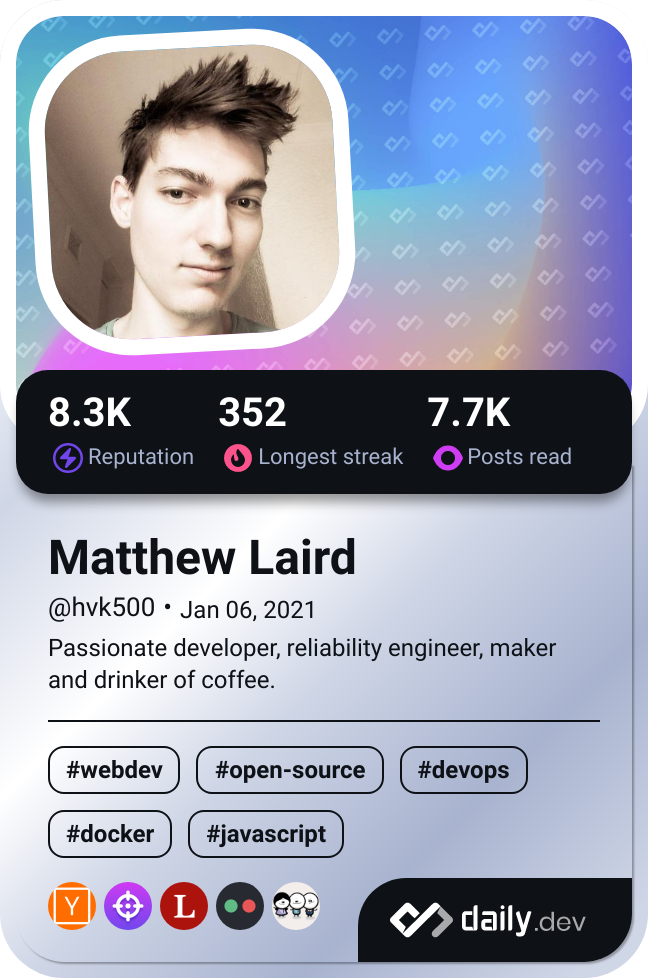

# 👋 Hello, I am Matthew

  
  

  

## 🔍 My passions

 - 🖨️ 3D Printing & Design: Creating functional models to solve real-world problems.
 - 🛠️ Platform Engineering: Working with Docker, Kubernetes, and containerized environments to build resilient, scalable systems.
 - 📦 Containers & Orchestration: Continuously learning and refining my skills with Kubernetes, Helm and Docker.
 - 💡 Open Source & Internet Freedom: Advocating for open software and a free, decentralized internet.
 - 🔧 Always Learning: If there’s something new to try, I am already probably giving it a go.
 - 🏠 Self-Hosting & Home Automation: Setting up and maintaining personal servers and networks for custom solutions and enhanced privacy.

I’m here to share projects, collaborate, and learn from the open-source community.
